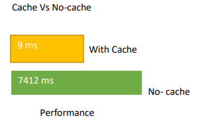

# Redis
Redis and Caching with NodeJs. Time comparison between Cached vs No Cached

When I first send the request to the server. The Server takes longer time to respond to the request i.e 7 sec because it has to get the data from the external API. And second time when I send the same request the server responds faster because it is stored in the cache.

 

